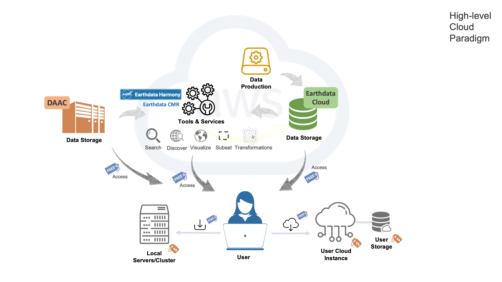

# Welcome

Welcome to the NASA Openscapes Cloud for Earth Science Book!  

This book contains awesome stuff!  

## The new cloud paradigm 

NASA Distributed Active Archive Centers (DAACs) are in the process of moving its data holdings to the cloud. In the new paradigm, the data storage, and DAAC-provided tools and services built on top of the data are co-located in the Earthdata Cloud (hosted in AWS cloud). 

As this data migration occurs, DAACs will have more information about how users can access data. For example, the [Cloud Data page at PO.DAAC](https://podaac.jpl.nasa.gov/cloud-datasets/about) offers access to resources to help guide data users in discovering, accessing, and utilizing cloud data.

Illustration by Catalina Oaida, PO.DAAC

